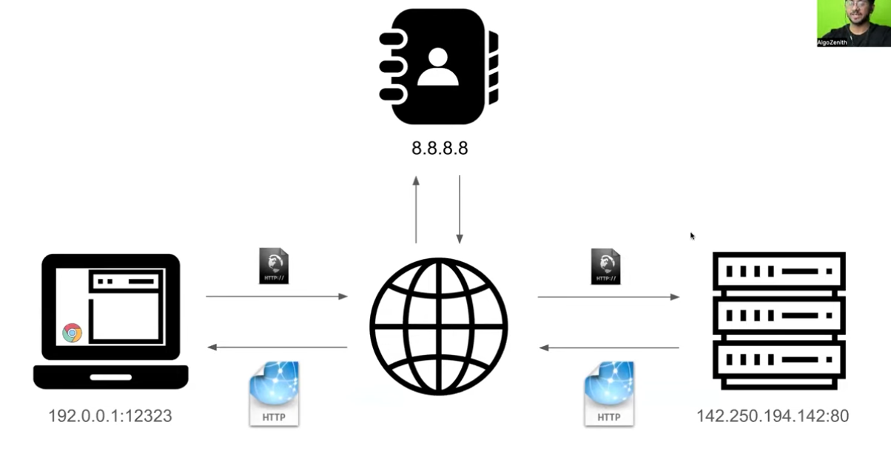
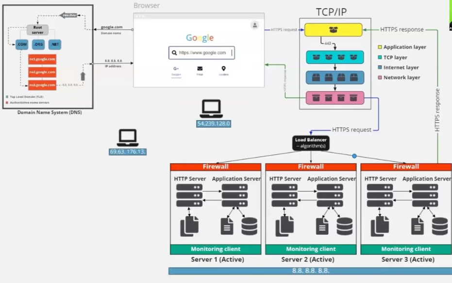

# DNS
dns is Domain Name System
it is treated a sthe phinebook of the internet

computers only understand ip address so dns helps us t convert the domain name to IP address 

IP address is a network specific

# If IP changes for every network, how can DNS map a name to an IP?
there are two types of IP addresses
1. Private IP (inside home or computer network)
2. Public IP(visible in internet)

Dns maps domain names to public ip address

google.com → 142.250.190.14(That IP is a public IP owned by google)
dns only care about public IP

when user request for a website, the server send the html,css and js files of that website

client side rendering:
    the browser(client) builds teh webpage using javascript
    instead of server sending fully ready HTML,
    server sends(HTML shell+JS)
    then jS runs in browser and build the webpage

server side rendering:
    the server builds the full HTML page and sends it ready-made to the browser
    browser just disyplays it ,no heavy js req to see initial content

SSR good for SEO(search engine optimization)
