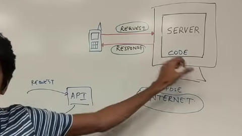

users-----request-----> Server
    <------Response---- Code

problems in the self hosting

desktop vs cloud

cloud ---> someone will provide the computation power(Set of computers)
ex: AWS

# scaling of business:
    solutions:
        1. buy a bigger machine
        2. buy more machines
        abilty to buy these is called scalability

Buy bigger Machines----->Vertical Scalaing
Buy more Machines   ------> Horizontal Scaling

# Horizontal Scaling
1. load balancing Required
2. no single point of failure
3. Network calls (RPC) slow
4. Data inconsistency
5. Scales wells as users increaes

# Vertical Scalaing
1. no load balancing
2. single point of failure
3. inter process communication (fast)
4. consistent data
5. Hardware Limit

both of the are used in read world

# Hybrid Scaling
    1. Resilient
    2. Inter process communication
    3. Scales well as users increases
    4. Consistent

small spaces are increased to bigger as the vertical scaling

initally vertical and then horizontal scaling
