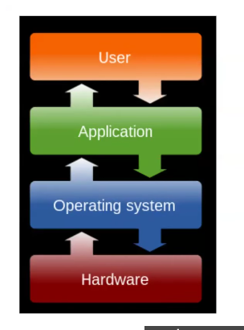
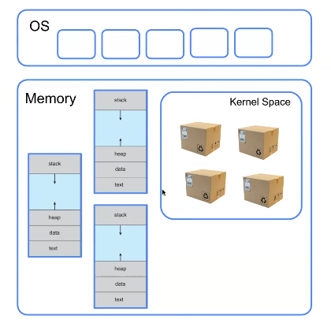
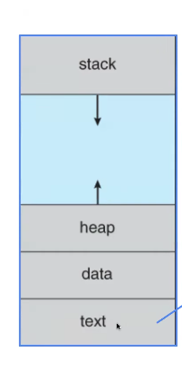
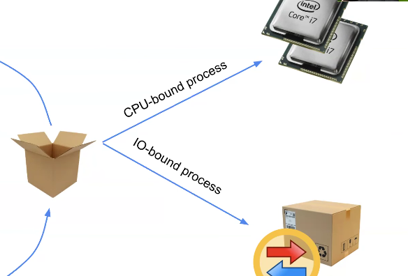
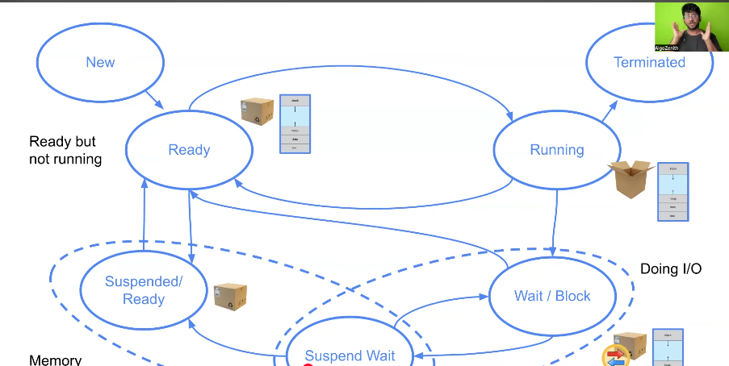
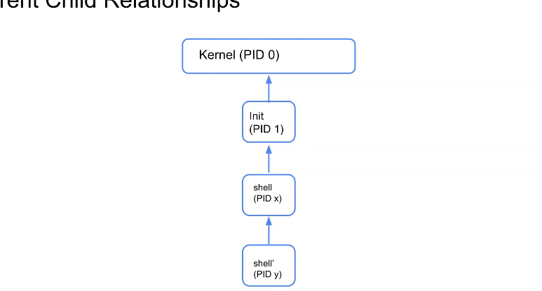
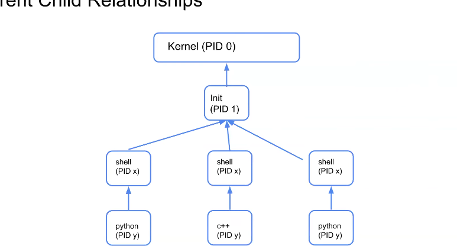
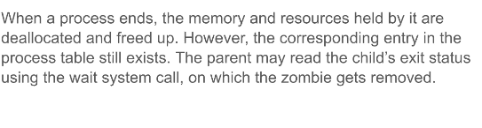
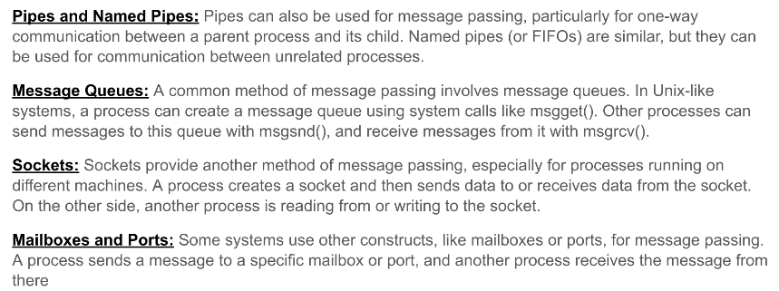
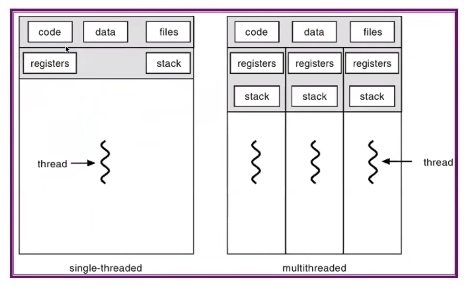

user--->Application---->Operating System---->Hardware 

everything will interact with the OS to get output via output devices

OS most important piece of software
OS is the schema , it is implemented by others(windows by microsoft)

code->excutable binary-->OS(Process Manager)-->Kernal Space,Memory

something is running inside computer is called processes
OS open the kernal space using Dispatcher and send it to the CPU

OS has Bunch of other programs which interacts with applications and interacts with CPU and hardware (all these stuff)

OS itself also loads first when Computer is turned on
bootloader-->loasds the OS and its kernal

# process control block (PCB) contains
    1. process ID (unique id for program)
    2. Process State (whether program is running or closed)
    3. Program counter
    4. Registers-->(helps to snapshot of apps like when you have pausing an app and opening it again to use(resume) )
    5. Memory Limits(RAM is like a big array stores the limits of index (l,r) of the program that is running)
    6. List of Open Files (opens required files before running a program)

1. text--> Code segment (code is stored) (machine code)
2. data---> constant or global variables are stored 
3. heap-->malloc ,realloc operations
4. stack--> functions and local variables

when total memory is used -->stack overflow
local variabels are limited than global ones

memory->{
    {
        kernal space->{ memory parts}
    }
}
# content Switching
when a program is ruuning and another program is opened the previous program is taken as a snapshot and closed temporarily inside kernal space(PCB) and the new program is opened
(user friendly multitasking)

states of process?
1. Ready
2. Running

PCB

new->ready->running->{wait/block}->terminated

suspend==swap the program into harddisk from ram

# Kernal
it is a part of operating System which directly interacts with the hardware

## Dual Operation Mode:
the process which need to run high privieged instructions it should take permission from kernal to turn on the kernal mode(mode bit=0)
mode bit=1 -->user mode

System Calls-what and why?

user space----->>kernal space(reserved space)

OS started-->kernal started
init() is teh first program to run

sudo is like user level
kernal is like hardware level

kernal has access to everything

parent process is closed but child process is running if it is done by intentional then it is called intentional orphan process otherwise unintentional orphan process

intentional orphan also called as daemon process

unintentional orphan process are called zombie process

# Operations on Processes
1. Termination - termination of process
2. Communication:
    # (Inter Process communication)
    ## pipe lining    
    what is pipe(|) command?
        A pipe connects one command’s output directly into another command’s input.
        ex: $ ls|grep txt 
        ls -> lsit all files
        grep txt only keep txt files

    ls runs and its output is stored inside pipe which is created by by pipe()
    ls must output in terminal but here it is not get output instead its output stores in pipe

    next it tells that to execte grep command but its input is not given by user instead it should take inputs from the output of las stored inside the pipe

    this is what all the things happen in pipe command
    it is like stack(x|y|z)-->(out(x)->inp(y)->out(y)->inp(z)->out(z)->terminal) 

    ## shared memory (communication mode -1)
    process 1--->memory<----process 2

    ## Message passing (mode -2)

    

    # Threads and multiThreading
    process is heavier one , so a lightweight process is called a thread
    
    

    If it has only one thread:
    When it waits for I/O → CPU sits idle 😴
    If it has multiple threads:
    One thread waits for I/O
    Another thread uses the CPU to do work
    👉 CPU doesn’t waste time

    Parallelism:
        On multicore systems, threads can run in parallel and speed up computation.
    
    Threads(TCB) ---> PCB
    1. Thread iD
    2. Thread State
    3. Program counter
    4. Registers
    5. stack pointer
    6. Scheduling info

    every thread has its own stack
    ------A Big Stack------
    |->stack for thread 1
    |->stack for thread 2

    1 program is runned then 1 PCB is created
    if it has multithread process code then multiple TCBs are created

    linux implemented as there is a comon structure acts as TCB as well as PCB

    code->process->threads
    context switching does happens in threads
    