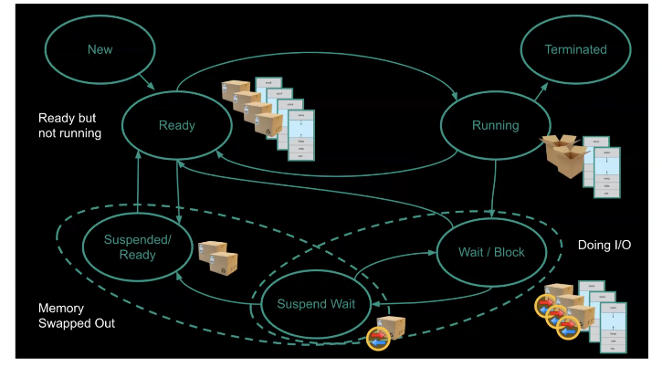
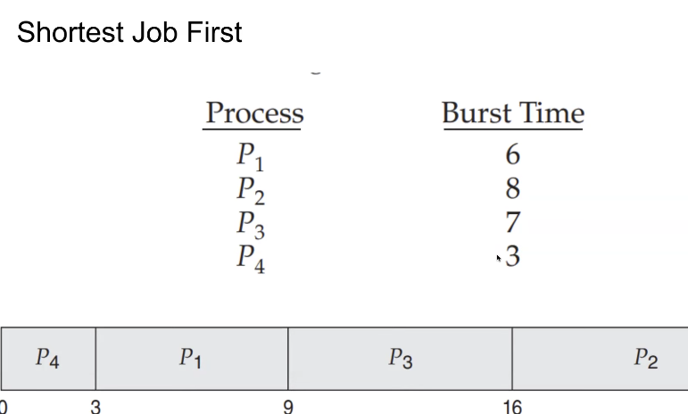
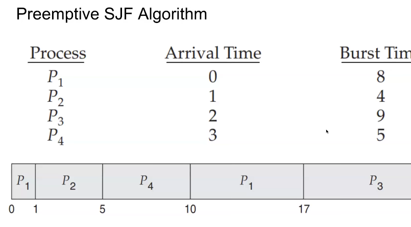
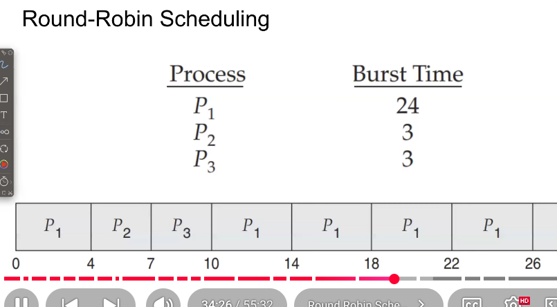
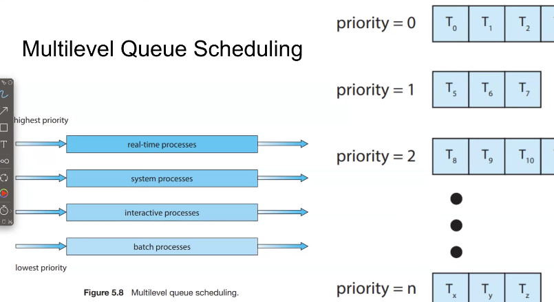

# Designing Schedules- what to optimize?

1. CPU utilization-CPU should busy 100% of time to prevent the wastage of CPU cycles
2. Throughput-no. of processes completed per unit of time
3. Turnaround time- total time to complete a process
waiting time-time taken by the process which is waiting for CPU
4. Response time- time taken by an interactive program(like terminal) to issue a command till getting a response for that command

# Gantt charts

1. Firts-come,firts served scheduling
2. shortest job first 

how do we know how much time a process should take?
    -> A good guess using statistics(MATH)

3. preemptive SJF algorithm

it is alike a good DSA question like greedy way we can solve this

in practical we cant utilize the CPU 100% bcz there is a time wastage for teh context switching and I/O operations

4. Round Robin scheduling - make scheduling for all process to run in equal time

5. Priority Scheduling - sheduling processes based on the prority

6. Hybrid Approaches(Priority+Round Robin) - if process have same priority then round robin is used

7. Multilevel queue scheduling

we mignt want guarantee - process should end or terminated after a certain period of time(deadline)

8. Earliest-Deadline-First scheduling
 shorter dead line process should be completed firat

# Multicore CPU scheduling

Instead of 1 CPU core, we have multiple cores inside one processor.
Each core can execute a separate process/thread simultaneously.

1. Asymmetric Multiprocessing (AMP)

One core = Master
Other cores = Slave
Master handles:
    Scheduling
    I/O
    System tasks
Slaves only execute tasks given by master.

2. Symmetric Multiprocessing (SMP)

All cores are equal
Each core can schedule processes
Shared memory

ex:linux,mac,windows use this

# Multithreaded multicore system

🔹 Multicore System
Multiple physical cores in one CPU.

🔹 Multithreaded System
Each core can execute multiple threads.

So when both combine:
Multiple cores AND each core can run multiple threads.
That’s a Multithreaded Multicore System.

two levels of scheduling:
level 1- which software thread comes to which cpu core
level 2- how each core decides which hardware thread to run

hardware thread is created by cpu hardware and managed by processor

# 1. LoadBalancing 

Distributing threads evenly across CPU cores so that no core is overloaded while others are idle.

how does it run?
1. push migration-- overloaded cores pushes thread to lighter ones
2. pull migration -idle core pulls tread from busy core

# 2. Processor Affinity

try to keep a thread ruuning on the same core it ran before
bcz of cpu cache

types:
1. soft affinity- os tries to keep the thread on same core(but can move)

2. Hard affinity- thread id strictly bound to specific core

# 3. Resouce contention
When multiple threads share same core resources and compete for them.
avoid resource contention by not placing competing threads on the same core
Remember:
In SMT (Hyperthreading),
Two hardware threads share:

ALU

FPU

Cache

Memory bandwidth