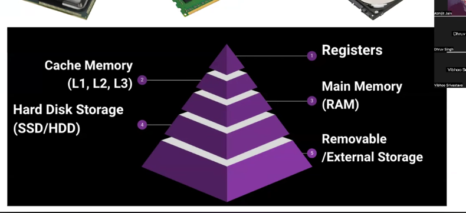
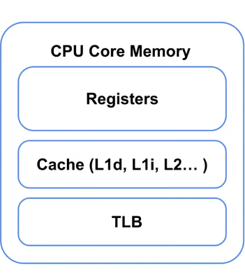
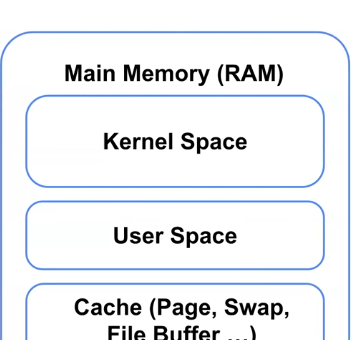
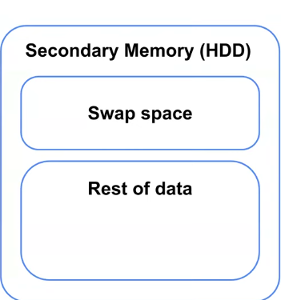
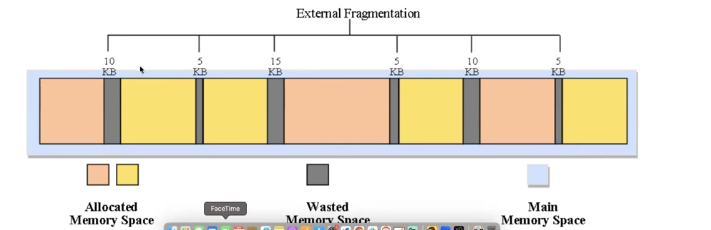
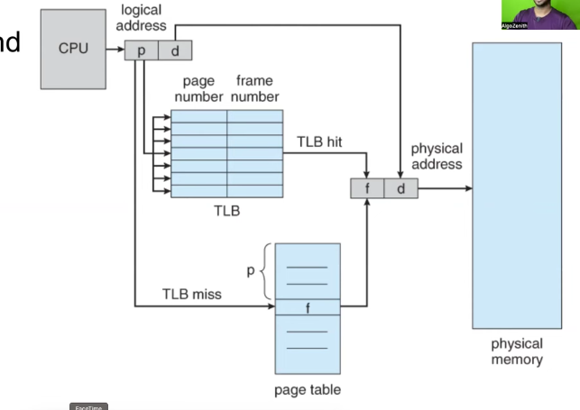
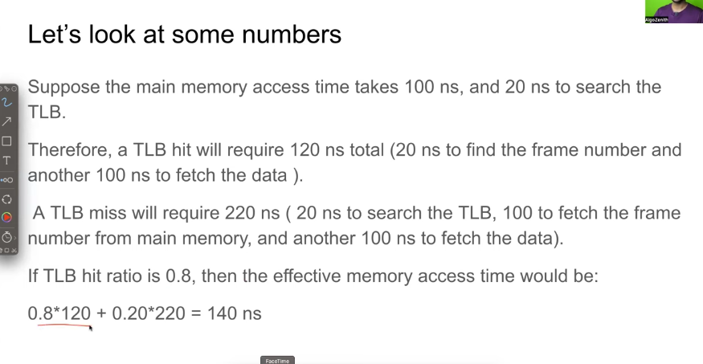
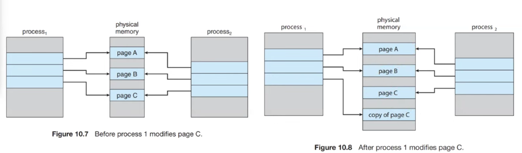

CPU has Registers

CPU Memory

RAM

Secondary Memory(HDD)

PCB is in kernal space in RAM
address space is in User Space in RAM

# Address Binding:

compile time binding:

the memory address of the program is fixed during compilation.
if memory location changed -->recompile the program

load time binding:

the address is decided while loading teh program
compiler generates the relative address
and loader adds actual starting address

execution time binding:

the address is decides while executing the program
high flexible
used in modern systems

# Fragmentation
the memory space is not usable because of the free space is splitted into fragments betwen the programs

external fragementation:

segmentation:

stores the programs into its respective segments(memory is divided into segements) and while accessing the program ,it can access through the segement id or by first 5 bits

# TLB(transition lookaside buffer) is like a cache layer  ---> inside CPU

CPU page number teesukuntundi
Page table lo search chesthundi
Frame number theeskuntundi
Physical address form chesthundi

page table is in ram(but it is expensive than TLB)

# Virtual Memory

Technique that allows programs to run even if they are larger than physical RAM.

Program full RAM lo undadu.
Only needed parts RAM lo untayi.

Remaining parts disk lo untayi.

demand paging

->page faualt impact
->prepaging

page replacement:
1. FIFO
2. Beladys MIN
3. LRU

Thrashing:

System spends more time swapping pages than executing actual program.

reduce degree of multiprogramming
increase ram
page replacement models(LRU)
working set model

# Copy-on-Write (CoW):
Instead of copying memory immediately,
OS copies it only when modification happens.

